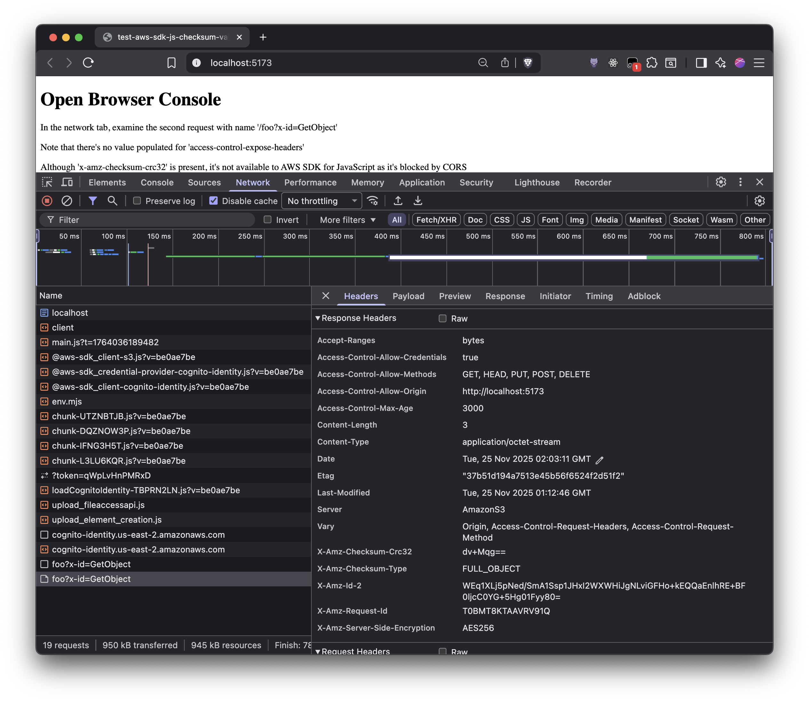

# test-aws-sdk-js-checksum-validation

Minimal repro to check checksum validation with AWS SDK for JavaScript in browser.

## Prerequisites

To set up this notes app, complete the following tasks:

- Install **Node.js** by following these steps:
  1. Install [nvm](https://github.com/nvm-sh/nvm#installation-and-update).
  1. Use node v24.x.x by running `nvm use` or `nvm use 24` in a terminal window.
  1. Verify that node is installed by running `node -v` in a terminal window and confirm that it shows Node.js >=24, such as `v24.11.1`).
  1. Install corepack by running `npm install -g corepack` in a terminal window.
- Install dependencies by running `yarn`.
- If you don't have an AWS account, [create one](https://aws.amazon.com/premiumsupport/knowledge-center/create-and-activate-aws-account/).
  - If you're an Amazon employee, see the internal wiki for creating an AWS account.
- Install the [AWS CLI](https://aws.amazon.com/cli/).
  - Verify that the AWS CLI is installed by running `aws` in a terminal window.
- Set up [AWS Shared Credential File](https://docs.aws.amazon.com/cli/latest/userguide/cli-configure-files.html).

## Setup

- Copy `.env.example` to `.env`.
- [Create a Amazon Cognito Identity pool for testing](https://docs.aws.amazon.com/sdk-for-javascript/v3/developer-guide/getting-started-browser.html#getting-started-browser-create-identity-pool)
  - Note down IDENTITY_POOL_ID
- [Add a Policy to the test Unauthenticated IAM Role](https://docs.aws.amazon.com/sdk-for-javascript/v3/developer-guide/getting-started-browser.html#getting-started-browser-iam-role)
  - The policy should be specific to the operations you want to test
- Update resources in `.env`:
  - `VITE_BUCKET` should have the bucket being tested.
  - `VITE_IDENTITY_POOL_ID` should have the identity pool being tested.
  - `VITE_REGION` should have the region being tested.
- The bucket "Cross-origin resource sharing (CORS)" should allow the localhost origin
  - `"AllowedOrigins": [ "http://localhost:5173"]`

## Test

- Run `yarn put:object` to put test object in bucket.
- Run `yarn get:object` to open vite project which gets the test object.

Open Network tab in the browser and note that:
- There's no value populated for 'access-control-expose-headers'
- Although 'x-amz-checksum-crc32' is present, it's not available to AWS SDK for JavaScript as it's blocked by CORS

  

Click to view screenshot

  

  

  

  

If you want to expose specific headers over CORS, the `ExposeHeaders` configuration needs to be updated in S3 Bucket CORS configuration.

For this specific case, where CRC32 checksum is stored, the configuration is `"ExposeHeaders": ["x-amz-checksum-crc32"]`